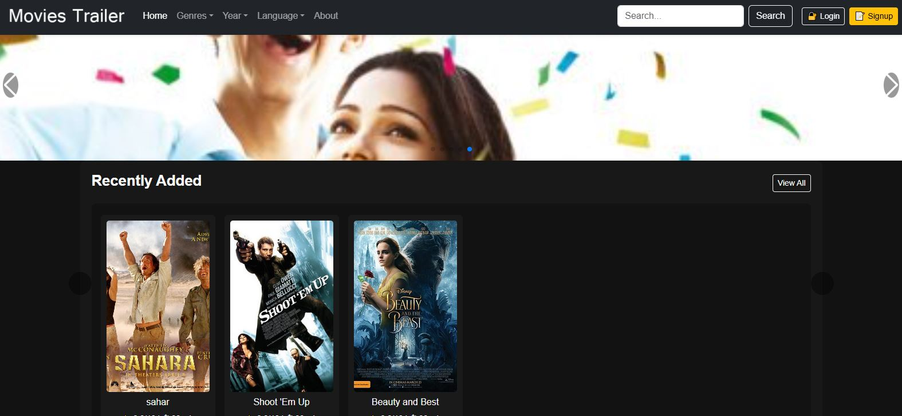
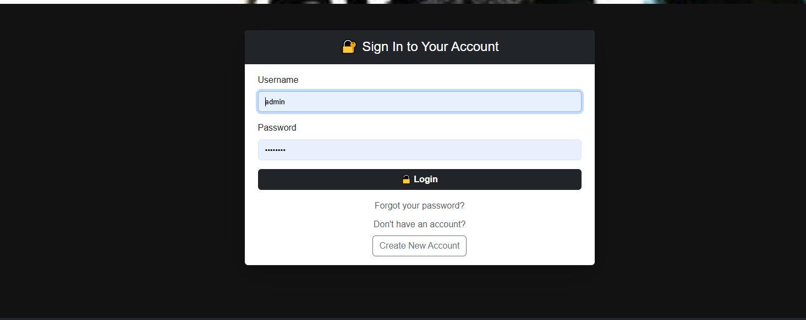
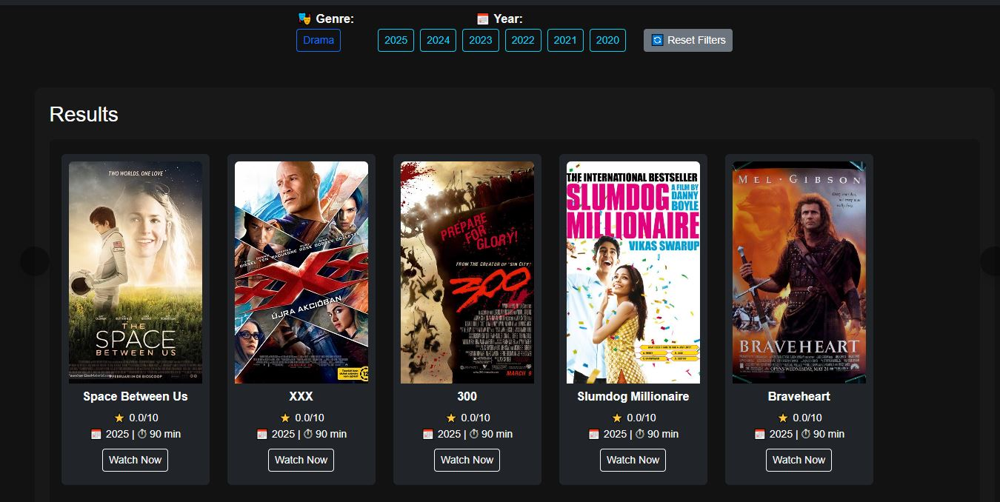

# 🎬 Aminul Movie Site (IMDB Clone)

A professional movie web application built with **Django**, featuring Swiper sliders, dynamic filtering, pagination, user authentication, and more. This project replicates core features of IMDB, tailored for portfolio demonstration and future scalability.

---

## 🚀 Features

- 🎥 Movie listing by genre, language, and release year
- 🔍 Search & filter with pagination
- 👤 User Authentication (Sign Up, Login, Logout)
- 🔐 Password Reset via Email with HTML template
- 🎞️ Movie Detail Page
- 🖼️ Swiper Slider for featured movies
- 📅 Archive view by year
- 🌐 Fully responsive layout (HTML + CSS)
- 📬 Custom password reset email template with button

---

## 📸 Screenshots

### 🏠 Home Page


### 🔐 Login Page


### 🎬 Movie Detail Page


---

## 📁 Project Structure

src/
├── movie/ # Main Django app
├── templates/ # HTML templates
│ └── registration/ # Auth-related templates (login, password reset)
├── static/ # CSS, JS, Swiper files
├── images/ # Screenshots for README
├── requirements.txt
└── README.md

---

## 📦 Requirements

Make sure to activate your virtual environment first:

```bash
# On Windows
.\env\Scripts\activate

cd src
python manage.py runserver

🛠️ Tech Stack
Python 3.12

Django 5.2

HTML5 / CSS3 / Bootstrap

SwiperJS

Email Backend (console/email HTML)

SQLite3 (default)

👤 Author
Aminul Islam Sumon
🔗 GitHub: aminul-portfolio

